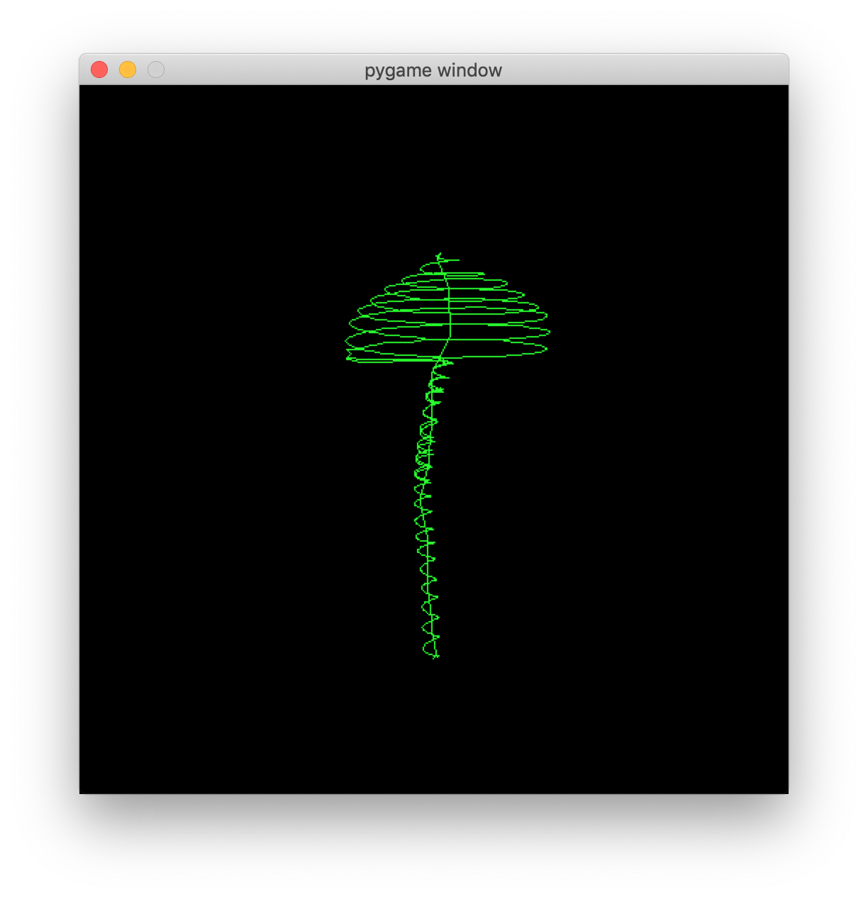

# wavedraw

> See the music

<p align="center">
  
</p>

Wavedraw is a simple python program to view [Oscilloscope Music](https://www.youtube.com/watch?v=qnL40CbuodU) using [pygame](https://github.com/pygame/pygame). The project was created merely out of curiosity to see if I could understand how to decode and display the music. It was written in winter of 2018.

## Usage

```bash
$ pipenv install
$ pipenv run python wavedraw.py <audio file>
```

## Bugs

- Sound playback is choppy
- Playback speed is slightly slower than reality
